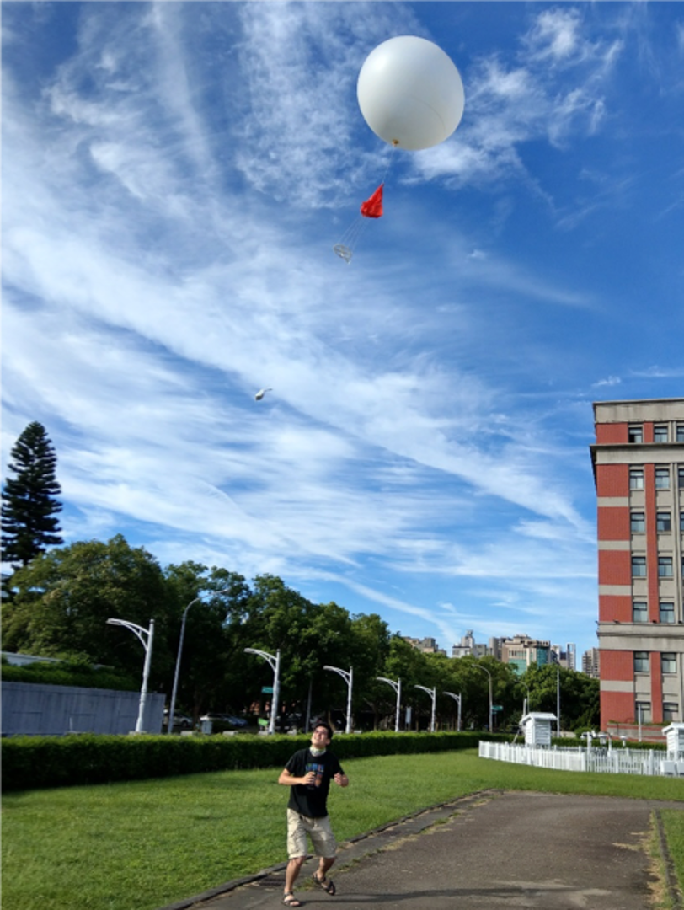
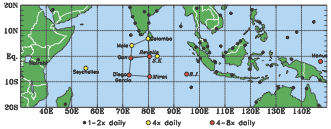
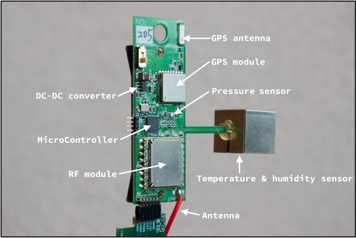
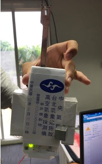
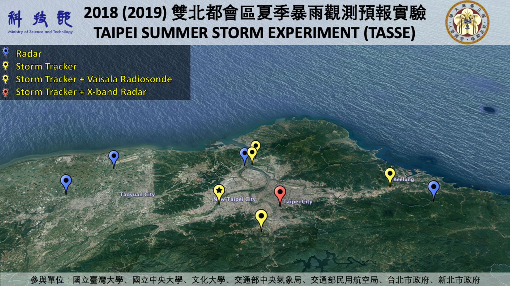

---

---

Radiosondes remain one of the most direct ways to observe the vertical structure of the atmosphere. Accurate profiles of temperature, humidity, and wind are essential for diagnosing convective environments, evaluating numerical models, and building reliable climate records. Yet raw soundings carry instrument- and platform-dependent errors, such as solar radiation biases in temperature and humidity sensors. Rigorous quality assurance and quality control (QA/QC) is therefore a prerequisite for turning field observations into research-grade datasets.

This research develops and evaluates QA/QC and correction methods for upper-air observations, from large international field campaigns to new low-cost radiosonde systems designed for high-frequency sampling.

{fig-alt="Radiosonde launch during a field campaign"}

### Tropical Field Campaigns: [DYNAMO/CINDY/AMIE](https://www.eol.ucar.edu/field_projects/dynamo)

The DYNAMO upper-air network spanned the tropics from eastern Africa to the western Pacific and collected nearly 26,000 soundings between October 2011 and March 2012. Post-field processing applied multiple levels of quality checks and corrections for issues including daytime humidity dry bias, surface baseline errors, ship deck heating, and artificial dry spikes in slow-ascent soundings. Particular attention was given to humidity correction and its validation.

{#fig-dynamo fig-alt="Map of DYNAMO sounding sites across the tropical Indian Ocean and western Pacific"}

Building on this dataset, a comparison of the proprietary DigiCORA and the open-source GRUAN humidity corrections for Vaisala RS92 radiosondes at tropical sites showed that the two algorithms are statistically consistent at most levels. Corrected precipitable water also agreed well with independent ground-based microwave radiometer estimates. These QCed observations later supported studies of quasi-2-day (Q2D) convective disturbances over the equatorial Indian Ocean.

### High-Resolution Mini-Radiosondes: Storm Tracker

The Storm Tracker is an ultra-lightweight (~20 g including battery) radiosonde developed in 2016 by the Department of Atmospheric Sciences at National Taiwan University. Its low cost and multi-channel receiver allow multiple sondes to be tracked simultaneously, enabling high-temporal-resolution profiling of the lower atmosphere during severe weather. Initial co-launches with the Vaisala RS41-SGP showed highly consistent pressure and wind measurements. A daytime warm bias from solar heating was identified and mitigated with a dedicated metal shield.

::: {layout-ncol=2}
{fig-alt="Storm Tracker mini-radiosonde"}

{fig-alt="Storm Tracker attached to an RS41 for co-launch"}
:::

More than one thousand co-launches with the RS41-SGP were conducted in field campaigns across Taiwan from 2016 to 2022, providing over a million comparable observations. From these, correction methods were developed for Storm Tracker temperature and humidity. After correction, root-mean-square differences relative to the RS41 are about 1 K for temperature and 7% for relative humidity, decreasing to 0.66 K and 4.61% below 700 hPa, with wind errors of about 0.05 m s⁻¹. These results show that the Storm Tracker can complement operational radiosondes for high-resolution observations of the lower troposphere, as deployed in campaigns such as TASSE (2018) and PRECIP (2021).

{#fig-st fig-alt="The TASSE upper-air sounding network."}

Research topics include

- **Field-campaign sounding datasets:** post-field processing, quality checks, and dataset development.
- **Humidity bias correction and validation:** evaluating correction algorithms against independent precipitable water estimates from GPS and microwave radiometers.
- **Low-cost radiosonde calibration:** characterizing and correcting sensor biases through co-launches with reference radiosondes.
- **Observation-driven science:** applying quality-controlled soundings to tropical convective variability and severe storm environments.

## Related Works

Kuo, H.-C., T.-S. Yo, **H. Yu**, S.-H. Su, C.-H. Liu, P.-H. Lin, 2025: Data quality control and calibration for Mini-Radiosonde System “Storm Tracker” in Taiwan. *Journal of the Meteorological Society of Japan Ser II (気象集誌 第2輯)*, **103(5)**, 573–593. [](https://doi.org/10.2151/jmsj.2025-029)

Hwang, W.-C., P.-H. Lin, **H. Yu**, 2020: The development of the “Storm Tracker” and its applications for atmospheric high-resolution upper-air observations. *Atmospheric Measurement Techniques*, **13**, 5395–5406. [](https://doi.org/10.5194/amt-13-5395-2020)

**Yu, H.**, R. H. Johnson, P. E. Ciesielski, H.-C. Kuo, 2018: Observation of Quasi-2-Day Convective Disturbances in the Equatorial Indian Ocean during DYNAMO. *Journal of the Atmospheric Sciences*, **75**, 2867–2888. [](https://doi.org/10.1175/jas-d-17-0351.1)

**Yu, H.**, P. E. Ciesielski, J. Wang, H.-C. Kuo, H. Vömel, R. Dirksen, 2015: Evaluation of humidity correction methods for Vaisala RS92 Tropical Sounding data. *Journal of Atmospheric and Oceanic Technology*, **32**, 397–411. [](https://doi.org/10.1175/jtech-d-14-00166.1)

Ciesielski, P. E., **H. Yu**, and Coauthors, 2014: Quality-Controlled Upper-Air Sounding Dataset for DYNAMO/CINDY/AMIE: Development and corrections. *Journal of Atmospheric and Oceanic Technology*, **31**, 741–764. [](https://doi.org/10.1175/jtech-d-13-00165.1)